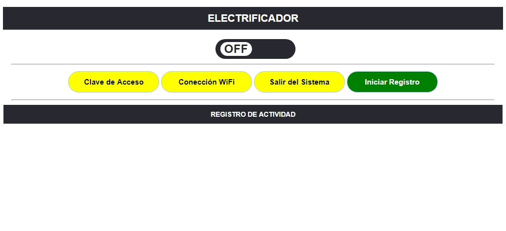
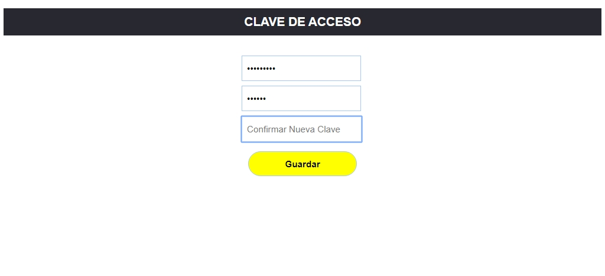
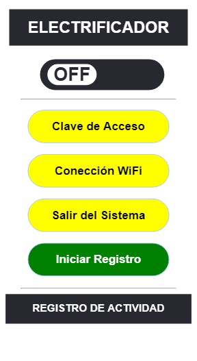
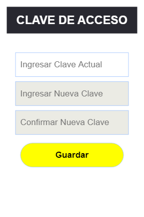

control-electrificador
=

App web para controlar electrificador de cercas de perimetros residenciales.

Este proyecto se trata sobre una aplicacion WEB que sirve como control remoto de un electrificador de cercas usado para la seguridad de perimetros en areas residenciales.

## (Funsiones)
+ Poder controlar el electrificador a distancia a través de una computadora o smartphone.
+ Monitoriar el estado de la cerca.
+ Apagar/encender el electrificador.
+ Mostrar un registro de eventos.
+ Almacenar las anomalias de la cerca en una base de datos
+ Entre otras

## (Tecnologías Usadas)

### **Software:**
+ HTML5
+ CSS3
+ + Response Design
+ JavaScript
+ + Librería Jquery
+ + Librería 'Push.js'
+ PHP 7.2 (Utilizando PDO)
+ Base de Datos MySQL
+ Programación en Arduino
+ Manejo del lenguaje de comandos AT
+ Técnicas de control de flujo

#

### **Hardware:**
+ Fuente conmutada
+ Fuente lineal
+ Bateria auxiliar (12v de plomo)
+ Transformador elevador de tensión
+ Amplificador de sonido (Alarma)
+ Arduino UNO (Placa de Desarrollo)
+ Modulo WiFi ESP-8266

## (Pantalla - escritorio)

## (Pantalla - movil)

## (Diagrama - Circuito)

...

## (Prototipo)

...
